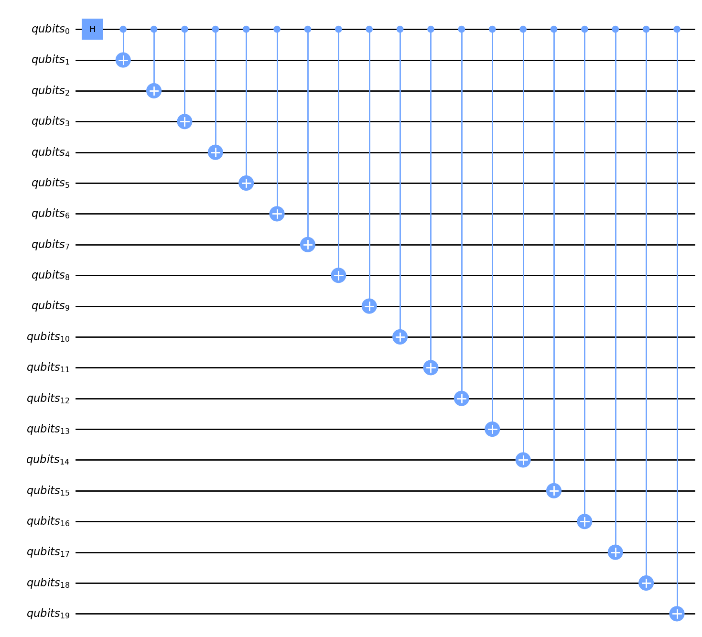
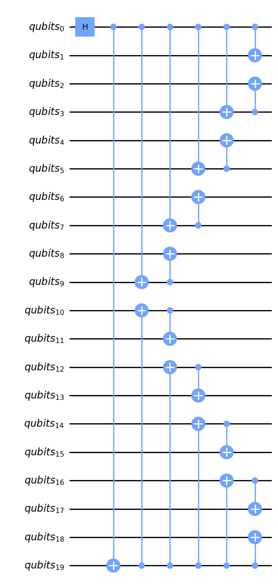

# GHZ state quantum circuit with low depth 

[](https://github.com/jvscursulim/low_depth_ghz_state_generator/actions/workflows/ci.yaml)
[](https://codecov.io/gh/jvscursulim/low_depth_ghz_state_generator)
[](https://github.com/psf/black)

## License

[GNU GPL v.3.0](https://github.com/jvscursulim/ghz_state_qc_with_low_depth/LICENSE)

## Description

A repository about GHZ state preparation with low depth quantum circuits. In the NISQ device era, one way to improve the results obtained in a experiment on a quantum computer, is to reduce the number of qubits, the number of gates and the circuit depth, because these points can increase the chance of occurence of a quantum error. Combining these reductions on the number of qubits, the number of gates and circuit depth, with error mitigation techniques and good usage of devices coupling map layout, we have an excellent setup to achieve very good results on a real device. Once entangled states, like GHZ state, are a fundamental resource on quantum computation (for instance: Quantum Teleportation, Superdense coding, QECC and others), having a way to prerare these states with high state fidelity is a key piece to achieve good results on some quantum algorithms and protocols, then is very important that quantum computing community spend some time trying to build and find some techniques that aim the reduction of number of qubits usage, the number of gates and the circuit depth.

## How to use

1. Clone the repository
```bash
git clone 
```
2. Create a virtual environment
```bash
python -m venv env
```
3. Activate your virtual environment
* Linux
```bash
source env/bin/activate
``` 
* Windows
```bash
cd env/Scripts
call activate
```
4. Install pipenv and the necessary packages
```bash
pip install pipenv
pipenv install
```

## Code snippet

```python
from qiskit_aer import AerSimulator

from ghz_state_preparator import create_ghz_state_quantum_circuit

qc = create_ghz_state_quantum_circuit(num_qubits=num_qubits, add_measurements=True)
counts = backend.run(qc, shots=shots).result().get_counts()
```

## Figures

Example: 20 qubits GHZ state

* Standard circuit


* Low depth circuit


## References

1. [Greenberger-Horne-Zeilinger state](https://en.wikipedia.org/wiki/Greenberger%E2%80%93Horne%E2%80%93Zeilinger_state)
2. [Entanglement and GHZ states](https://quantum-computing.ibm.com/lab/docs/iqx/guide/entanglement#ghz-states)
3. [Circuit depth](https://qiskit.org/documentation/apidoc/circuit.html)

